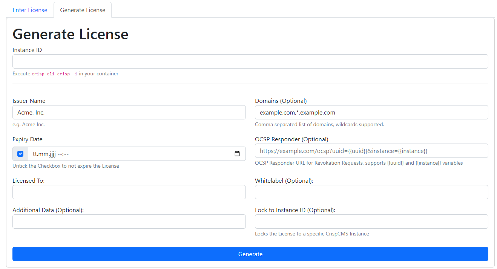

## Generate a License

Crisp's License System relies on an asymmetric cryptography system and comprises the following components:

- The Issuer Private Key (A) (employed on your CrispCMS Instance to generate a License).
- The Issuer Public Key (C) (delivered to your customers).
- The License Key (B) (distributed to your customers, signed with your private key (C)).


To generate a license, you have two options:

1. Utilize CrispCMS's built-in License Generator.
2. Create your own License Generator using a theme.


## Built in License Generator



The built-in license generator can be accessed via the magic URL `_license`, for example, `https://example.com/_license`

The generated license includes the following properties:


| Field Name              | Description                                                      |
| ----------------------- | ---------------------------------------------------------------- |
| Issuer Name             | e.g. Acme Inc.                                                   |
| Domains (Optional)      | Comma separated list of domains, wildcards supported.             |
| Expiry Date             | Untick the Checkbox to not expire the License                    |
| OCSP Responder (Optional) | OCSP Responder URL for Revocation Requests, supports {{uuid}} and {{instance}} variables |
| Licensed To             | Name of the customer                                             |
| Whitelabel (Optional)   | Custom Branding                                                  |
| Additional Data (Optional) | Your own Supplied data                                           |
| Lock to Instance ID (Optional) | Locks the License to a specific CrispCMS Instance              |


After hitting `Generate` Crisp downloads an `issuer.pub` and `license.key`, ship both to your customer.


## Programmatically

Upon clicking Generate, Crisp generates and downloads two files, `issuer.pub` and `license.key`, both of which should be shipped to your customer."

```php
$license = new \crisp\api\License(
    version: \crisp\api\License::GEN_VERSION,
    uuid: core\Crypto::UUIDv4(),
    whitelabel: "Acme Inc. CMS",
    domains: ["example.com", "*.example.com"],
    name: "Bob Inc.",
    issuer: "Acme Inc.",
    issued_at: time(),
    expires_at: time() + 3600, // 1 Hour from Issuance Date, NULL for no expiry
    data: null,
    instance: null,
    ocsp: null,
);

if(!$license->sign()){
    // Could not sign license
}

$licenseKey = $license->exportToString();
$publicKey = Config::get("license_issuer_public_key");
```

The constructor of the License class takes several parameters:


| Parameter    | Description                                                      |
| ------------ | ---------------------------------------------------------------- |
| version      | Specifies the version of the license (GEN_VERSION constant)       |
| uuid         | Generates a random UUID using UUIDv4 method                       |
| whitelabel   | Sets the whitelabel name to "Acme Inc. CMS"                       |
| domains      | Array of domains: ["example.com", "*.example.com"]                |
| name         | Sets the name of the license holder to "Bob Inc."                 |
| issuer       | Sets the name of the license issuer to "Acme Inc."                |
| issued_at    | Sets the issuance date to the current time (time() function)      |
| expires_at   | Sets the expiration date to current time + 3600 seconds           |
| data         | Set to null                                                      |
| instance     | Set to null                                                      |
| ocsp         | Set to null                                                      |


