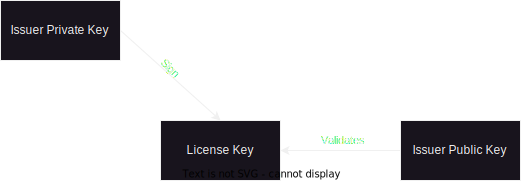
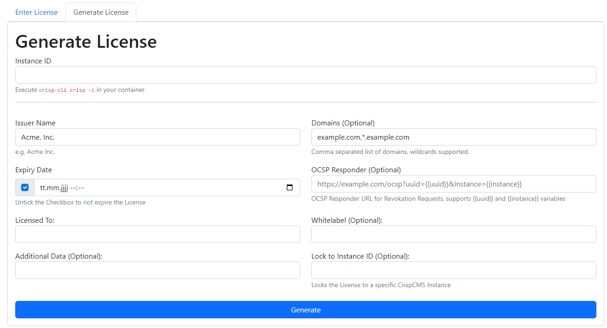

# License System

CrispCMS supports a license system so you can safely distribute your themes and only let authorized persons host it.

With Crisps License System you have built in checks against:

1. Domains - Only allow specific domains to host your Theme in
2. Expiry - Expire the latest after a specific date
3. OCSP - Crisp incorporates its own Online Certificate Status Protocol so you can remotely block licenses
4. Instance ID - Lock your theme to a specific Crisp Instance.

