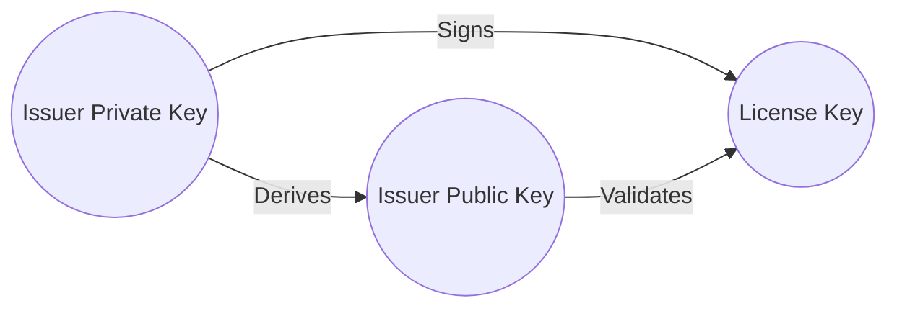

# License System

CrispCMS offers a robust license system, allowing you to securely distribute your themes and restrict hosting access to authorized license holders.

With Crisp's License System, you benefit from built-in safeguards against the following:

- Domains: Restrict theme hosting to specific domains.
- Expiry: Automatically expire licenses on a specified date.
- OCSP: Utilize Crisp's integrated Online Certificate Status Protocol to remotely block licenses.
- Instance ID: Securely bind your theme to a specific Crisp Instance.

