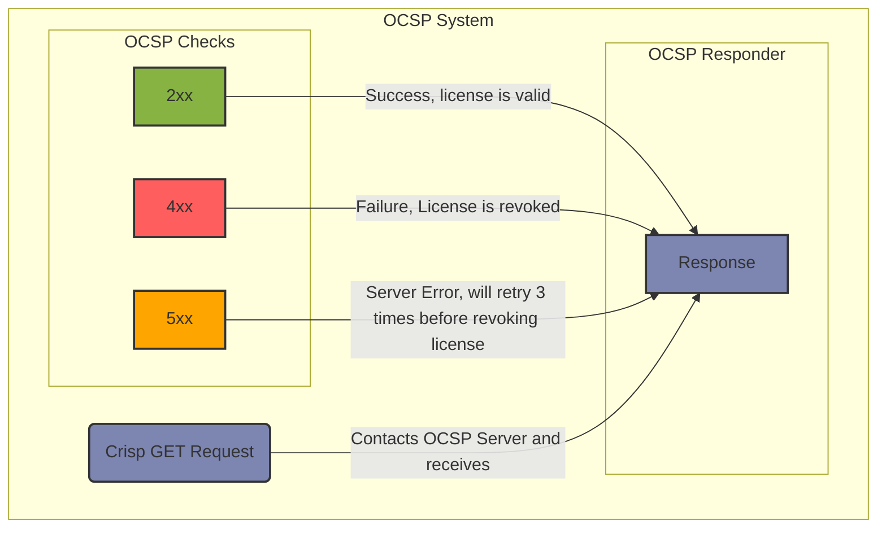

## OCSP

With OCSP you can validate a license against a Responder

The OCSP property exposes two variables

| Placeholder   | Description                      |
| ------------- | -------------------------------- |
| {{uuid}}      | The UUID of the license          |
| {{instance}}  | The ID of the Instance           |

By constructing an OCSP Url against a custom system, you can make sure the license can be revoked!

### HTTP Codes

Crisp's OCSP System checks for the following status codes in a GET request against the OCSP Responder

| Status Code | Description                                            |
| ----------- | ------------------------------------------------------ |
| 2xx         | Success, license is valid                              |
| 4xx         | Failure, License is revoked                            |
| 5xx         | Server Error, will retry 3 times before revoking license |

Crisp only awaits the HTTP Code, there is no need to send a body.

### Cache

OCSP Requests are in cache for 30 minutes