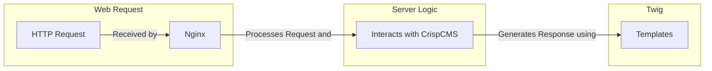

## Twig

Crisp utilizes the Twig template engine to render its content with custom filters and functions.

The relationship between twig and crisp is best explained in the following graph

### Globals

| Variable       | Description                                             |
|----------------|---------------------------------------------------------|
| config         | Array of KV Items                                       |
| locale         | Current User's Locale                                   |
| languages      | Array of available Languages                            |
| GET            | $_GET Array                                             |
| POST           | $_POST Array                                            |
| SERVER         | $_SERVER Array                                          |
| GLOBALS        | $GLOBALS Array                                          |
| COOKIE         | $_COOKIE Array                                          |
| ENV            | $_ENV Array                                             |
| isMobile       | If the useragent of the current user is a mobile device |
| URL            | Current Url                                             |
| CLUSTER        | Current Hostname(s)                                     |
| VM_IP          | IP Adress(es) of container                              |
| REQUEST_ID     | UUID of current request                                 |
| VERSION_STRING | Pretty Debug Version String                             |

### Filters
| Filter        | Description                          | Reference Function                                                                                                                                   |
|---------------|--------------------------------------|------------------------------------------------------------------------------------------------------------------------------------------------------|
| bcdiv         | PHP bcdiv                            | [bcdiv](https://www.php.net/manual/en/function.bcdiv.php)                                                                                            |
| integer       | PHP intval                           | [intval](https://www.php.net/manual/en/function.intval.php)                                                                                          |
| double        | PHP doubleval                        | [doubleval](https://www.php.net/manual/en/function.doubleval.php)                                                                                    |
| json          | Alias of json_decode                 | [json_decode](https://www.php.net/manual/en/function.json-decode.php)                                                                                |
| json_encode   | PHP json_encode                      | [json_encode](https://www.php.net/manual/en/function.json-encode.php)                                                                                |
| json_decode   | PHP json_decode                      | [json_decode](https://www.php.net/manual/en/function.json-decode.php)                                                                                |
| base64_encode | PHP base64_encode                    | [base64_encode](https://www.php.net/manual/en/function.base64-encode.php)                                                                            |
| unserialize   | PHP unserialize                      | [unserialize](https://www.php.net/manual/en/function.unserialize.php)                                                                                |
| md5           | PHP md5                              | [md5](https://www.php.net/manual/en/function.md5.php)                                                                                                |
| translate     | Translate the given string           | [Translation::fetch](https://crispcms.jrbit.de/api/da/d71/classcrisp_1_1api_1_1_translation.html#ac3eb935cc896c46f385bb29ce8e5b8bb)                  |
| getlang       | Get language name by code            | [Languages::getLanguageByCode](https://crispcms.jrbit.de/api/df/d3a/classcrisp_1_1api_1_1lists_1_1_languages.html#a3fc784b856bc4ccfd560f055a14b54c1) |
| truncateText  | Truncate text by specific characters | [Helper::truncateText](https://crispcms.jrbit.de/api/dc/d9c/classcrisp_1_1api_1_1_helper.html#a203b5d4956d3d5af2ebf5192613f1f3b)                     |
| strtotime     | PHP strtotime                        | [strtotime](https://www.php.net/manual/en/function.strtotime.php)                                                                                    |
| time          | PHP time                             | [time](https://www.php.net/manual/en/function.time.php)                                                                                              |

### Functions

| Function            | Description                                                           | Reference Function                                                                                                                                       |
|---------------------|-----------------------------------------------------------------------|----------------------------------------------------------------------------------------------------------------------------------------------------------|
| prettyDump          | Pretty Print Objects, var_dump but pretty                             | [API Reference](https://crispcms.jrbit.de/api/dc/d9c/classcrisp_1_1api_1_1_helper.html#a93a7eee8cb14ed9864e7195da83b4a32)                                |
| includeResource     | Include a local Resource, Remote Resource through a Proxy with Hashes | [API Reference](https://crispcms.jrbit.de/api/d5/d1d/classcrisp_1_1core_1_1_themes.html#a3b3268ad7cf31480c61707b1cfa736c4) \| [Guide](/themes/resources) |
| generateLink        | Generate a link with additional UTM parameters                        | [API Reference](https://crispcms.jrbit.de/api/dc/d9c/classcrisp_1_1api_1_1_helper.html#a4b4c57aa3fd0d4b3de1cc478bc4f7c99) \| [Guide](/themes/links)      |
| generatePlaceholder | Generate a Placeholder Image                                          | [API Reference](https://crispcms.jrbit.de/api/dc/d9c/classcrisp_1_1api_1_1_helper.html#a01423e47dde2182fe83bec3a8bbca984)                                |
| date                | PHP date                                                              | [PHP Doc](https://www.php.net/manual/en/function.date.php)                                                                                               |
| in_array_any        | in_array_any helper function                                          | [API Reference](https://crispcms.jrbit.de/api/dc/d9c/classcrisp_1_1api_1_1_helper.html#aac91f8010ad40dc069511f3534eb4fa3)                                |
| csrf                | Deprecated, use getCSRF                                               | [API Reference](https://crispcms.jrbit.de/api/df/dd6/classcrisp_1_1core_1_1_security.html#a755b8ffb10f860314862366b34704ace) \| [Guide](/themes/csrf)    |
| refreshCSRF         | Regenerate the CSRF Token                                             | [API Reference](https://crispcms.jrbit.de/api/df/dd6/classcrisp_1_1core_1_1_security.html#ac4b0bc804a94bb993babdc767e9f17f5)  \| [Guide](/themes/csrf)   |
| validateCSRF        | Verify if the supplied CSRF token matches                             | [API Reference](https://crispcms.jrbit.de/api/df/dd6/classcrisp_1_1core_1_1_security.html#ac4b0bc804a94bb993babdc767e9f17f5)  \| [Guide](/themes/csrf)   |
| getCSRF             | Get the current CSRF Token                                            | [API Reference](https://crispcms.jrbit.de/api/df/dd6/classcrisp_1_1core_1_1_security.html#a755b8ffb10f860314862366b34704ace) \| [Guide](/themes/csrf)    |
| strftime            | PHP strftime                                                          | [PHP Doc](https://www.php.net/manual/en/function.strftime.php)                                                                                           |
| strtotime           | PHP strtotime                                                         | [PHP Doc](https://www.php.net/manual/en/function.strtotime.php)                                                                                          |
| time                | PHP time                                                              | [PHP Doc](https://www.php.net/manual/en/function.time.php)                                                                                               |
| parseTime           | Parse a Timestamp using the Carbon Library                            | [Carbon Doc](https://carbon.nesbot.com/docs/)                                                                                                            |
| render              | Deprecated                                                            |                                                                                                                                                          |