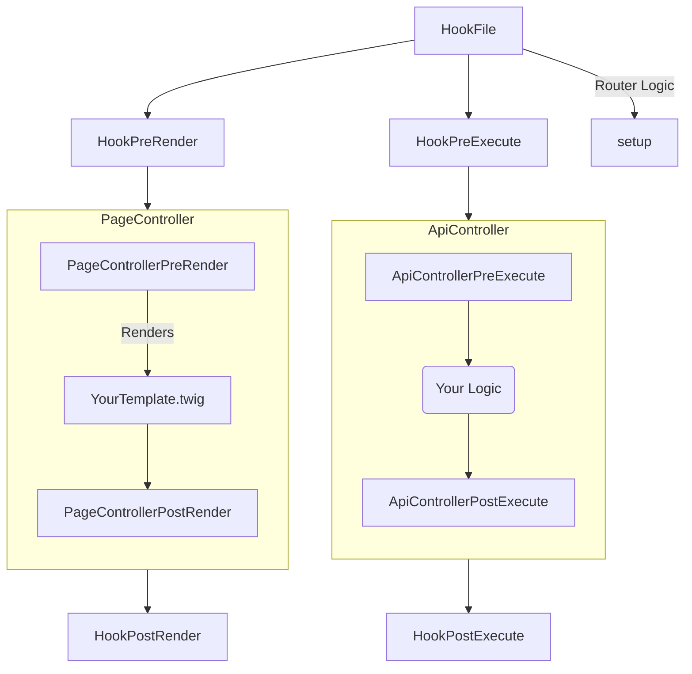

# HookFile

The Hookfile is your theme entrypoint and controls the majority of the logic inside your theme such as but not limited to: routing

The Structure of a HookFile is as follows:

```mermaid
graph TB

subgraph PageController
  direction TB
  PageControllerPreRender --> |Renders| YourTemplate.twig --> PageControllerPostRender
end

subgraph ApiController
  direction TB
  ApiControllerPreExecute --> ApiControllerLogic("Your Logic") --> ApiControllerPostExecute
end

HookFile --> HookPreRender --> PageController --> HookPostRender
HookFile --> HookPreExecute --> ApiController --> HookPostExecute
HookFile -->|Router Logic| setup
```