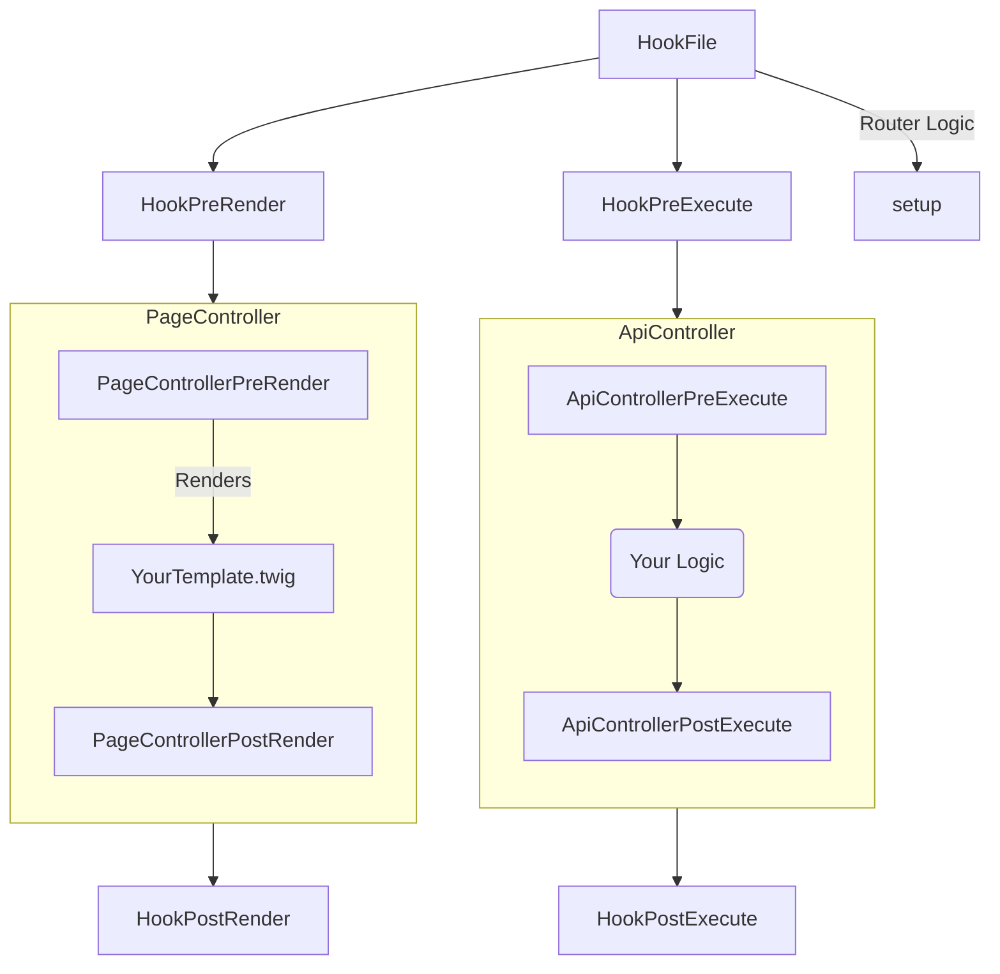

# HookFile

The Hookfile is your theme entrypoint and controls the majority of the logic inside your theme such as but not limited to: routing


## Structure

The Structure of a HookFile is as follows:





## Getting Started

The File name of the HookFile is not hardcoded, it simply must be a readable PHP file as defined in the [[/themes/json|theme.json]] section `hookFile`

!> The filename `hook.php` is reserved and may cause conflicts!

## Example Theme Hook

```php
<?php

use crisp\core\Cron;
use crisp\core\Router;
use crisp\core\Themes;
use example\views\controllers\StartPageController;
use crisp\types\RouteType;
use example\views\controllers\CronTestController;

class ThemeHook {

    /**
     * @description This function executes before any RESTful API Class is triggered.
     **/
    public function preExecute(): void  {

    }

    /**
     * @description This function executes after any RESTful API Class is triggered 
     **/
    public function postExecute(): void {

    }


    /**
     * @description This function executes after a template has been rendered 
     **/
    public function postRender(): void {
        
    }


    /**
     * @description This function executes before a template has been rendered 
     **/
    public function preRender(): void {

    }


    /**
     * @description This function executes before a template has been rendered 
     **/
    public function setup(): void {
        Router::add("/", RouteType::PUBLIC, StartPageController::class);

        Themes::addRendererDirectory(Themes::getThemeDirectory(). "/iamnotincludedbydefault");
    }

    /**
     * @description This function executes when the CLI is executed 
     **/
    public function setupCli(): void {
        Cron::registerJob("30 * * * *", CronTestController::class, "execute");
    }


}
```