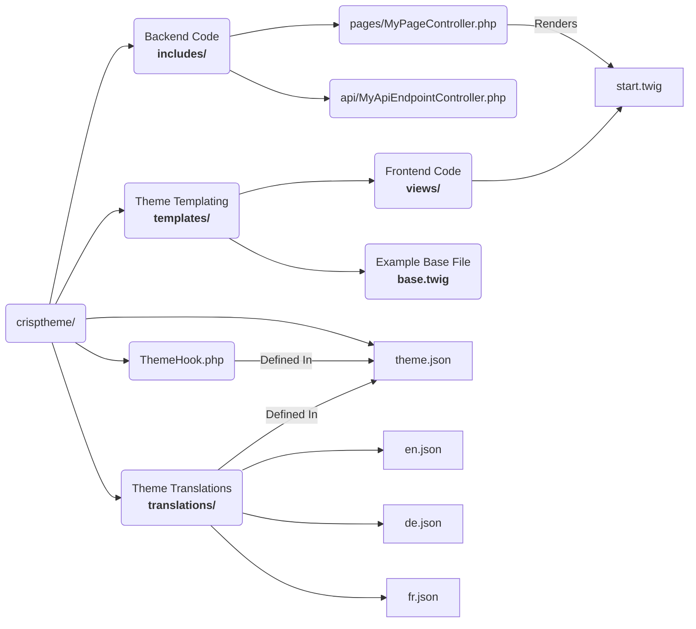

# Themes

Themes are crucial to run CrispCMS

The Structure of a Theme is as follows:

| Path                | Description                                         |
| ------------------- | --------------------------------------------------- |
| /                   | Your Theme Folder                                   |
| /theme.json         | All the Metadata of your theme                      |
| /ThemeHook.php      | Hook File for Global code execution                 |
| /translations/      | Contains all your translation data                  |
| /translations/en.json | Translations for the English locale                 |
| /templates/         | Theme Template Directory                            |
| /templates/views/   | This directory is responsible for serving your pages. A `start.twig` file is an index file, for instance. |
| /includes/          | Is handling the backend code and must contain a start.php file |
| /includes/api/      | Contains the API routes                             |

!> The `includes/` folder must always match the `views/` folder - A `start.twig` cannot be displayed without an `start.php`

?> An Example and a Theme Template are available on [Github](https://github.com/JRB-IT/theme-template)